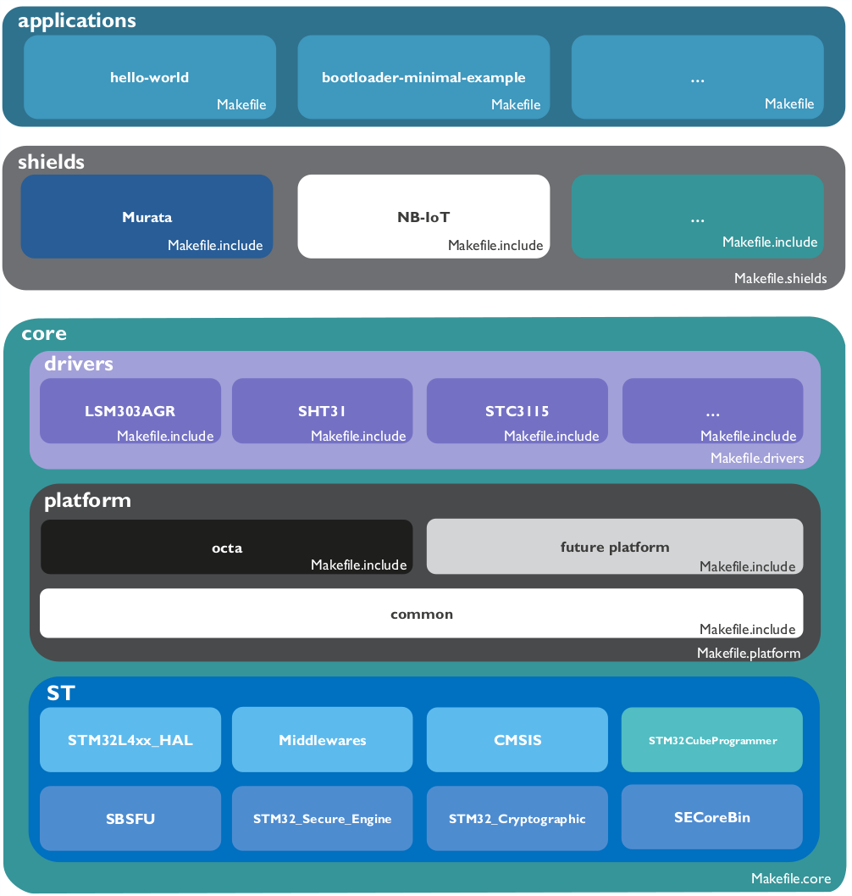

# octa-stack <!-- omit in toc -->

This repo contains the octa-stack with some example applications.

- [Architecture](#architecture)
  - [core](#core)
    - [drivers](#drivers)
    - [platform](#platform)
      - [common](#common)
      - [octa](#octa)
    - [ST](#st)
  - [shields](#shields)
  - [applications](#applications)
- [Makefiles](#makefiles)
  - [Application Makefile](#application-makefile)
    - [Application Name](#application-name)
    - [Platform](#platform)
    - [Float Support](#float-support)
    - [Shield Definitions](#shield-definitions)
    - [Bootloader](#bootloader)
    - [Step Up Pin](#step-up-pin)
    - [Link to core makefile](#link-to-core-makefile)
  - [Makefile.core](#makefilecore)
  - [Makefile.platform](#makefileplatform)
  - [Makefile.drivers](#makefiledrivers)
  - [Makefile.shields](#makefileshields)
- [Getting Started](#getting-started)
  - [Compiling](#compiling)
    - [arm-none-eabi-gcc](#arm-none-eabi-gcc)
    - [GNU Make](#gnu-make)
  - [Flashing](#flashing)
    - [ST-Link](#st-link)
    - [Switching between ST-Link and J-Link](#switching-between-st-link-and-j-link)
    - [J-Link](#j-link)
  - [Make Command Overview](#make-command-overview)
  - [vscode support](#vscode-support)
    - [tasks.json](#tasksjson)
    - [cortex-debug extension](#cortex-debug-extension)
    - [launch.json](#launchjson)

***

## Architecture

The architecture of the octa-stack consists of three main parts being the [core](#core), [shields](#shields) and [applications](#applications).

\
*octa-stack architecture*

### core

The core of the stack consists of some common [drivers](#drivers), support for different [platforms](#platforms) and platform independent [ST](#st) code.

#### drivers

The drivers in this folder are common, and for the current octa platform always onboard and available.

#### platform

The platform sections consists of a common part and a part for each supported platform.

##### common

The common platform has some common functions such as `Initialize_Platform()`. This will in turn call the platform initialize function of the selected platform. For now, this common part is rather limited.

##### octa

This is the original platform, consisting of a `NucleoL496ZG-P` board, and the `octa-connect` expansion shield.\
Platform specific code for GPIO, UART, SPI, I2C, Watchdog Timers, Interrupts, FreeRTOS schedulers, etc is found here.
Furthermore, the platform specific startup files and linker scripts are here.

#### ST

This section is for platform independent ST code:

- **STM32L4xx_HAL_Driver:** The low level code of STM32L4 boards
- **Middlewares:** The ST middlewares, mainly used for FreeRTOS low level code
- **CMSIS:** The CMSIS-FreeRTOS API
- **SBSFU, SECoreBin, STM32_Cryptographic, STM32_Secure_Engine:** Low level Secure Boot and Secure Firmware Update code of ST, used for the FOTA bootloader
- **STM32CubeProgrammer:** Binaries to flash an ST-Link device from the commandline, used for the `make flash-st` command

### shields

The shields folder contains drivers for all kinds of pluggable shields such as sensor shields, communication shields etc.\
Every shield requires a header to be defined for it in the application makefile, as described in the [shield definitions](#shield-definitions) section.

### applications

Some example applications are provided in this repo:

- **hello-world**: basic application, mainly to test the development environment setup.
- **acc-mag-sensor**: application using the accelerometer and magnetometer sensor on the octa.
- **lightsensor**: application using the lightsensor on the octa.
- **temperature-humidity**: application using the temperature & humidity sensor on the octa.
- **bootloader-minimal-example**: application showing the minimal requirements for an application to be compatible with the SBSFU bootloader.

***

## Makefiles

The stack uses Makefiles, with each application having a `Makefile` for the application settings.\
This Makefile links to the `Makefile.core`, which will link to all the required makefiles of the drivers, shields and platforms.

The end user should only come into contact with the [Application Makefile](#application-makefile). If this file is set up correctly, the rest should be automated.

### Application Makefile

This file contains the high level settings of the application, such as the name, platform and the required shields.

#### Application Name

The application name is defined as follows, and will end up being the name of the target binary.

```bash
# name of your application
APPLICATION = hello-world
```

#### Platform

The platform is defined as follows, with currently only the main octa platform being supported.

```bash
# platform for which the application will be built
PLATFORM ?= octa
```

#### Float Support

If floats have to be printed of sprinted, some extra libraries have to be included. To do this, `PRINT_FLOATS` has to be set to 1.

```bash
# Set PRINT_FLOATS to 1 to enable linker flags enabling float printf & sprintf
PRINT_FLOATS = 1
```

#### Shield Definitions

To use a shield in the application, the user has to define the name of the shield and a header connector in the application makefile. This connector number is passed to the code as a define using a -D parameter when compiling.

```bash
# SigFox
SHIELDS += SigFox
SIGFOX_CONNECTOR = 1
```

An *OCTA_header* struct will to be passed to the driver. This struct contains UART, I2C, SPI and GPIO Handles.\
These structs are defined during the platform initalization e.g. P1_header, P2_header, ...\
It is up to the shield driver to initialize the required handle with the driver's specific settings.

```c
struct OCTA_header{
    uint8_t                     number;
    UART_HandleTypeDef          *uartHandle;
    I2C_HandleTypeDef           *i2cHandle;
    SPI_HandleTypeDef           *spiHandle;
    struct OCTA_GPIO            *DIO1;
    struct OCTA_GPIO            *DIO2;
    struct OCTA_GPIO            *DIO3;
    struct OCTA_GPIO            *DIO4;
    struct OCTA_GPIO            *DIO5;
    struct OCTA_GPIO            *DIO6;
    uint8_t                     active;
};
```

#### Bootloader

To use the FOTA SBSFU bootloader in the application, this has to be set in the `Makefile` as follows.\
Some bootloader specific code also has to be implemented in the application, shown in the *bootloader-minimal-example* application.

```bash
# use the SBSFU bootloader
BOOTLOADER ?= 1
```

#### Step Up Pin

To enable or disable the step up pin, the `ENABLE_STEPUP` variable has to be set to 1 or zero respectively. This will step up the battery voltage to 5V to the octa headers.

```bash
# enable the stepup pin
ENABLE_STEPUP ?= 1
```

#### Link to core makefile

Finally, the link to the `Makefile.core` has to be made.

```bash
# Path to the octa-stack base directory:
STACKBASE ?= ../..

include $(STACKBASE)/core/Makefile.core
```

### Makefile.core

The `Makefile.core` file is, as the name suggests, the core of every application.\
First of all, the link to the selected platform, drivers and shields makefiles made.\
After the source files, header files, startup files and linker script are defined, the code is compiled to `application-name.hex,bin,elf`.

Furthermore, `make flash` support is provided.\
Both `J-Link` and `ST-Link` are [supported](#make-command-overview) by using *make flash-jlink* and *make flash-st* respectively.

### Makefile.platform

In the `Makefile.platform` file, a check is done on the platform name of the application Makefile. If not valid, the make command will throw an error. If valid, the `Makefile.include` file of the common platform folder is included as well as the `Makefile.include` of said platform.\
This file sets some platform specific setting such as the *CPU* type, platform specific source and header files, startup file and linker scripts.

A *PLATFORM_DEFINE* define is also created, which is passed to the code in the `Makefile.core` file.

```bash
# platform define var, passed to code when compiling in Makefile.core
PLATFORM_DEFINE += -D$(addprefix platform_,$(PLATFORM))
```

### Makefile.drivers

The purpose of this file is to include every source and header file in the `core/drivers/*` folder.

### Makefile.shields

This file will make sure that for every shield defined in the application `Makefile`, its `Makefile.include` file is included.\
These files contain the source and header files of each shield respectively. It also serves as a way to not having to include every shield driver in every application.

***

## Getting Started

This section will help you get started with compiling and flashing the code to the octa boards.

### Compiling

#### arm-none-eabi-gcc

The [arm-none-eabi-compiler](https://developer.arm.com/tools-and-software/open-source-software/developer-tools/gnu-toolchain/gnu-rm/downloads) has to be installed. For it to work in every folder, it has to be added to the PATH variable.\
On linux, an *arm-none-eabi-gcc* package is also available.
Once installed, the code can be compiled using the [make commands](##Make-Command-Overview).

#### GNU Make

To support the [make commands](#make-command-overview) on Windows, the [gnuwin32](http://gnuwin32.sourceforge.net/packages/make.htm) package has to be installed.\
This binary folder also has to be added to the PATH variable.\
On Linux, Make should work as is.

### Flashing

With the on board debugger of the `Nucleo` board supporting both `ST-Link` and `J-Link` firmware, both are supported in the octa-stack.

#### ST-Link

Out of the box, the on board debugger of the `Nucleo` board comes with `ST-Link` installed on it.\
To flash with the `ST-Link` debugger, the `STM32CubeProgrammerCLI` binaries are provided with the octa-stack.\
Make sure the [ST-Link usb drivers](https://www.st.com/en/development-tools/stsw-link009.html) are installed.

#### Switching between ST-Link and J-Link

To switch between `ST-Link` and `J-Link` and vice versa, a [ST-Link Reflash Utility](https://www.segger.com/products/debug-probes/j-link/models/other-j-links/st-link-on-board/) is provided by Segger.\
This tool does only work on Windows, but can be used in a Windows Virtual Machine on linux as well.

#### J-Link

Once switched to `J-Link` tools from the [J-Link Software and Documentation Pack](https://www.segger.com/downloads/jlink#J-LinkSoftwareAndDocumentationPack) can be used with the onboard debugger.\
This is particularly useful for debugging in [vscode](#cortex-debug-extension).

### Make Command Overview

Every make command has to be run from the folder of the target application.\
`make flash` support is provided for both `ST-Link` and `J-Link`, allowing for independency of editor/IDE and the option to work entirely in the CLI.

- **make**: this command will compile the code to a binary
- **make clean**: this command cleans up the build folder
- **make clean all**: this command cleans up the build folder, as well as recompile everything
- **make flash-st**: this command compiles the code and flashes the binary using [ST-Link](#ST-Link)
- **make flash-jlink**: this command compiles the code and flashes the binary using [J-Link](#J-Link)

### vscode support

Due to its flexibility, [vscode](https://code.visualstudio.com/) is suggested as IDE.\
A `.vscode` folder is provided for building and flashing/debugging support.

#### tasks.json

This file contains make and make clean all tasks for every application in the stack. These tasks can be ran by using the `ctrl+Shift+B` keyboard shortcut.

#### cortex-debug extension

The [cortex-debug](https://marketplace.visualstudio.com/items?itemName=marus25.cortex-debug) extension is particularly useful for debugging applications. It allows the user to set breakpoints, watch variables, registers, memory etc. This extension only works with [J-Link](#J-Link) installed on the onboard debugger.

#### launch.json

This file contains a launch tasks for every application in the octa-stack. After compiling the binary, it can be flashed and debugged by pressing the `F5` button and selecting the correct binary.
